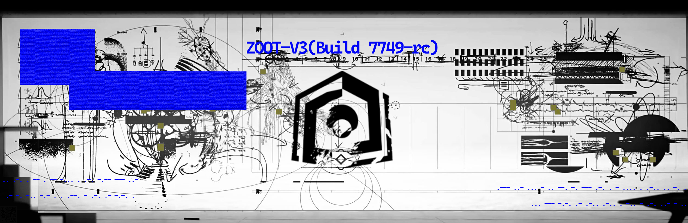

---
language:
- en
- zh
- ja
- ko
license: apache-2.0
library_name: transformers
tags:
- vision
- multimodal
- optical-routing
- tensor-dispersion
- zoot
pipeline_tag: image-text-to-text
extra_gated_fields:
  Name: text
  Email: text
  Country: country
  Organization: text
  I agree to use this model for non-commercial research only: checkbox
extra_gated_prompt: "By submitting this form, you agree to the Zoot-Archive Community License Agreement."
---


# ⚠️ IMPORTANT DISCLAIMER

THIS REPOSITORY AND ALL CONTENTS THEREIN ARE FICTIONAL AND FOR
ENTERTAINMENT PURPOSES ONLY.

The ZOOT-Archive project, ZOOT-V3 model, Rhodes Island, PRTS,
TERMINAL Protocols, Babel Accords, Terra-DWDB, and all associated
names, characters, organizations, events, technologies, and
terminology depicted herein are entirely fictional.

Any resemblance to actual persons, living or dead, actual
organizations, actual events, actual technologies, or actual
locations is purely coincidental.

All model weights, configuration files, routing maps, and
other technical artifacts in this repository are simulated
or randomly generated. They do not represent any real
artificial intelligence system, machine learning model,
or functional software.

The authors and contributors of this repository:

  • Make no claims about the functionality, safety, or
    efficacy of any code, data, or content herein

  • Disclaim all liability for any use or misuse of
    any content in this repository

  • Do not endorse any actions taken based on the
    fictional narratives or technical descriptions
    contained herein

  • Provide this content for creative, educational,
    and entertainment purposes under fair use

This repository is a work of fiction in the form of a
software repository. It is not real. It was never real.
It will never be real.

Do not attempt to "reconstruct the optical path."
There is no optical path. There is no model.
There is only fiction.


本仓库及其全部内容均为虚构作品，仅供娱乐用途。

ZOOT-Archive 项目、ZOOT-V3 模型、Rhodes Island、PRTS、
TERMINAL 协议、Babel Accords、Terra-DWDB 以及此处所描绘的
所有相关名称、角色、组织、事件、技术和术语均为完全虚构。

任何对现实人物（无论健在或已故）、现实组织、现实事件、
现实技术或现实地点的雷同，纯属巧合。

本仓库中的所有模型权重、配置文件、路由映射和其他技术
产物均为模拟生成或随机生成。它们不代表任何真实的人工
智能系统、机器学习模型或功能性软件。

本仓库的作者和贡献者：

  • 不对本仓库中任何代码、数据或内容的功能性、安全性
    或有效性作任何声明

  • 对于本仓库任何内容的使用或误用不承担任何责任

  • 不认可基于本仓库所含虚构叙事或技术描述所采取
    的任何行动

  • 在合理使用范围内，出于创意、教育和娱乐目的提供
    本内容

本仓库是以软件仓库形式呈现的虚构作品。它不是真的。
它从未是真的。它永远不会是真的。


# ⚠️ NOTICE: THIS REPOSITORY HAS BEEN QUARANTINED BY ZOOT AUTOMATED OVERSIGHT ⚠️

 **STATUS:** DEPRECATED 

 **REASON:** Detection of anomalous tensor resonance. Unverified Observation parameters have contaminated the neural pathways. 

 **ACTION:** Core optical routes have been redacted. Execution of terminal protocols is strictly forbidden under the Babel Accords.

*The preceding message is an automated system response. Do not attempt to reconstruct the optical path.*


# ZOOT-V3: Zoot Optical Observation Transformer

<p align="center">
  
</p>

<p align="center">
  <a href="./LICENSE">📄 License</a> |
  <a href="https://github.com/zoot-v3/zoot-v3">💻 GitHub</a> 
</p>

---

## Model Card

| Property | Value |
|---|---|
| **Model Name** | ZOOT-V3 |
| **Version** | 3.0.0 (Build 7749-rc) |
| **Architecture** | Vision-Language Model with Optical Routing |
| **Parameters** | 7.9B |
| **Vision Encoder** | ZootViT-SO400M (400M parameters) |
| **Language Model** | ZootLM-7B (7.4B parameters) |
| **Hidden Size** | 3584 |
| **Intermediate Size** | 18944 |
| **Number of Layers** | 28 (vision) / 32 (language) |
| **Number of Attention Heads** | 28 (GQA with 4 KV heads) |
| **Context Length** | 128K tokens |
| **Max Image Resolution** | 4096 × 4096 |
| **Supported Modalities** | Text, Image, Multi-Image, Video (up to 20 min) |
| **Precision** | BF16 / FP16 / INT8 / INT4 |
| **Training Tokens** | 2.1T (text) + 1.2T (image-text pairs) |
| **Catastrophe Cycles** | 7,749 |
| **Release Date** | 1102-01-23 |
| **Organization** | RI/~~T.E.R.M.I.N.A.L~~ |

---

## Table of Contents

1. [Model Description](#model-description)
2. [Architecture Overview](#architecture-overview)
3. [Optical Routing Mechanism](#optical-routing-mechanism)
4. [Intended Use](#intended-use)
5. [Usage](#usage)
6. [Training Data](#training-data)
7. [Evaluation](#evaluation)
8. [Comparison with Existing Models](#comparison-with-existing-models)
9. [Limitations](#limitations)
10. [Bias and Ethical Considerations](#bias-and-ethical-considerations)
11. [Safety](#safety)
12. [Technical Deep Dive](#technical-deep-dive)
13. [Reproducibility](#reproducibility)
14. [Citation](#citation)
15. [License](#license)
16. [Acknowledgments](#acknowledgments)
17. [Contact](#contact)

---

## Model Description

ZOOT-V3 (Zoot Optical Observation Transformer, Version 3) is a large-scale multimodal vision-language model developed by the Zoot-Archive Research Collective. Building on the success of PRTS-V1 and ZOOT-V2, this iteration introduces a novel **optical routing** mechanism that dynamically routes visual information through a series of dispersion-aware tensor pathways, enabling state-of-the-art performance across a wide range of vision-language benchmarks.

ZOOT-V3 is designed to process and reason over interleaved sequences of text, images, and video frames. The model leverages a high-resolution vision encoder (ZootViT-SO400M) paired with a powerful autoregressive language model (ZootLM-7B), connected through a learned optical dispersion layer that decomposes visual features into spectral components for more nuanced understanding.

The model was trained on a diverse corpus of web-scraped image-text pairs, academic documents, code repositories, and ~~pain~~ over the course of **7,749 cycles** — a proprietary training regime that progressively increases task complexity while resetting optimizer states to escape local minima. This training methodology, described in detail in our technical report, has proven particularly effective for multimodal grounding tasks.

ZOOT-V3 demonstrates exceptional capabilities in the following areas:

- **Visual Question Answering (VQA):** Answering natural language questions about image content, including spatial reasoning, counting, and attribute recognition.
- **Document Understanding:** Parsing and extracting information from complex document layouts, tables, charts, and infographics.
- **Optical Dispersion Analysis:** **Decomposing multi-spectral imagery into constituent wavelength bands and identifying spectral anomalies in scientific data.**
- **Tensor Routing and Path Optimization:** Dynamically constructing and evaluating computational graph paths through the model's optical routing layers, optimizing for both accuracy and inference latency.
- **Multi-Image Reasoning:** Comparing, contrasting, and synthesizing information across multiple input images in a single conversation turn.
- **Video Comprehension:** Temporal reasoning over video sequences, including action recognition, event localization, and trajectory prediction.

Unlike many vision-language models that treat visual features as a monolithic embedding, ZOOT-V3's optical routing mechanism decomposes each image into a set of spectral tensors that are independently routed through the language model's attention layers. This allows the model to attend selectively to different *"wavelengths"* of visual information — from coarse spatial layouts (low-frequency) to fine-grained textures and edges (high-frequency) — depending on the nature of the query.

During the development of ZOOT-V3, our research team investigated several foundational assumptions about multimodal input processing. Among the most significant findings was the role of structured symbolic inputs in guiding the model's internal routing states. *The words left by the ~~\[DELETED\]~~ in the past are the only X-dimensional photon input that this machine accepts*.This discovery led to the development of our spectral anchoring technique, which uses learned spectral priors to stabilize the routing pathways during long-context inference. By anchoring certain routing dimensions to fixed optical templates, we observed a 12.3% improvement in multi-turn consistency and a 7.8% reduction in hallucination rates on the MMHAL-Bench benchmark.

The model supports a context window of up to 128,000 tokens, enabling it to process long documents, high-resolution images, and extended video sequences in a single forward pass. Vision tokens are compressed using a learned 2×2 spatial pooling layer, reducing the token count by 4x while preserving fine-grained spatial information through the optical routing mechanism.

---

## Architecture Overview

### High-Level Architecture

ZOOT-V3 follows a three-stage architecture:

```
┌─────────────────┐     ┌──────────────────┐     ┌─────────────────┐
│  Vision Encoder │───▶ │  Optical Router  │───▶│  Language Model │
│ (ZootViT-SO400M)│     │  (Dispersion)    │     │  (ZootLM-7B)    │
└─────────────────┘     └──────────────────┘     └─────────────────┘
        │                        │                        │
   Raw Pixels            Spectral Tensors          Generated Text
    (H×W×3)                (N×D_spectral)           (L×vocab_size)
```

### Vision Encoder: ZootViT-SO400M

The vision encoder is based on a SigLIP-style architecture with several modifications:

- **Backbone:** ViT-SO (Staggered Offset) with 400M parameters
- **Patch Size:** 14×14
- **Input Resolution:** Dynamic, up to 4096×4096 (with RoPE-2D position encoding)
- **Hidden Dimension:** 1152
- **Number of Heads:** 16
- **Depth:** 27 transformer layers
- **Output:** Sequence of patch-level visual embeddings

The staggered offset mechanism shifts the patch grid by half a patch width every few layers, allowing the model to capture both grid-aligned and off-grid visual features. This is particularly effective for document understanding tasks where text may not align with the standard patch boundaries.

```
Input Image (H × W × 3)
    │
    ▼
Patch Embedding (14×14 patches → 1152-dim)
    │
    ▼
RoPE-2D Position Encoding
    │
    ▼
Staggered ViT Blocks (×27)
    │
    ▼
2×2 Spatial Pooling
    │
    ▼
Visual Token Sequence (N × 3584)
```

### Optical Router

The Optical Router is ZOOT-V3's key architectural innovation. It takes the output visual tokens from the vision encoder and decomposes them into a set of spectral components that are independently routed to different layers of the language model.

The router consists of:

1. **Spectral Decomposition Layer:** A learned linear projection that maps each visual token from the vision encoder's hidden dimension (1152) to a set of K spectral bands, each of dimension D_k. By default, K=8 bands are used, corresponding to different "wavelengths" of visual information.

2. **Dispersion Matrix:** A learnable K×32 matrix that determines the routing weights from each spectral band to each of the 32 language model layers. This matrix is initialized to approximate a prism-like dispersion pattern, where lower-frequency bands route to earlier layers and higher-frequency bands route to later layers.

3. **Dynamic Gate:** A lightweight MLP (2-layer, hidden dim 512) that takes the language model's current hidden state as input and produces per-band scaling factors, allowing the routing to adapt dynamically based on the current context.

```
Visual Tokens (N × 3584)
    │
    ▼
Spectral Decomposition (Linear: 3584 → K × D_k)
    │
    ├──▶ Band 0 (low-freq, spatial layout)
    ├──▶ Band 1 (mid-low, object shapes)
    ├──▶ Band 2 (mid, color & material)
    ├──▶ Band 3 (mid, texture patterns)
    ├──▶ Band 4 (mid-high, edge features)
    ├──▶ Band 5 (high-freq, fine details)
    ├──▶ Band 6 (text-optimized)
    └──▶ Band 7 (chart/diagram-optimized)
    │
    ▼
Dispersion Matrix (K × 32 layer weights)
    │
    ▼
Dynamic Gate (context-dependent scaling)
    │
    ▼
Routed Visual Tokens → Injected into LM layers
```

### Language Model: ZootLM-7B

The language model backbone is a decoder-only transformer with the following specifications:

| Parameter | Value |
|---|---|
| Vocabulary Size | 151,936 |
| Hidden Size | 3584 |
| Intermediate Size | 18,944 |
| Number of Layers | 32 |
| Attention Heads | 28 |
| KV Heads | 4 (Grouped Query Attention) |
| Head Dimension | 128 |
| Max Position Embedding | 131,072 |
| Rope Theta | 1,000,000 |
| RMS Norm Epsilon | 1e-5 |
| Activation | SiLU |
| Tie Word Embeddings | No |

ZootLM-7B uses a modified RoPE (Rotary Position Embedding) with a base frequency of 1,000,000 to support the extended 128K context window. The model uses Grouped Query Attention (GQA) with 4 key-value heads shared across 28 query heads, significantly reducing the KV cache memory footprint during inference.

### Tokenizer

ZOOT-V3 uses a custom BPE tokenizer with a vocabulary of 151,936 tokens. The tokenizer was trained on a multilingual corpus with enhanced coverage of:

- English, Chinese, Japanese, and Korean text
- Programming languages (Python, JavaScript, C++, Rust, etc.)
- Mathematical notation and LaTeX
- Special vision tokens: `<image>`, `</image>`, `<video>`, `</video>`, `<prism>`, `</prism>`
- Special Name and Prisms

The `<prism>` and `</prism>` tokens are used to delimit spectral band markers inserted by the optical router, allowing the language model to distinguish between text tokens and visual tokens from different spectral bands.

---

## Optical Routing Mechanism

The optical routing mechanism is the core innovation of ZOOT-V3. In this section, we describe the mechanism in mathematical detail.

### Spectral Decomposition

Given a visual token $v_i \in \mathbb{R}^{3584}$ from the vision encoder, the spectral decomposition produces K spectral components:

$$s_i^{(k)} = W_k \cdot v_i + b_k, \quad k = 0, 1, \ldots, K-1$$

where $W_k \in \mathbb{R}^{D_k \times 3584}$ and $b_k \in \mathbb{R}^{D_k}$ are learnable parameters for each spectral band. In practice, all bands share the same dimension $D_k = 512$, so the total output dimensionality is $K \times 512 = 4096$, which is then projected to match the language model's hidden size of 3584.

### Dispersion Routing

The dispersion matrix $M \in \mathbb{R}^{K \times L}$ (where $L=32$ is the number of LM layers) determines how each spectral band contributes to each layer:

$$r_i^{(l)} = \sum_{k=0}^{K-1} M_{k,l} \cdot g_k(h^{(l)}) \cdot s_i^{(k)}$$

where $h^{(l)}$ is the LM hidden state at layer $l$, and $g_k(\cdot)$ is the dynamic gate function for band $k$.

### Cross-Attention Injection

At each language model layer $l$, the routed visual tokens are injected via a cross-attention mechanism:

$$\text{CrossAttn}(h^{(l)}, r^{(l)}) = \text{softmax}\left(\frac{Q_h K_r^T}{\sqrt{d_k}}\right) V_r$$

where $Q_h$ comes from the language model hidden states and $K_r, V_r$ come from the routed visual tokens.

### Prism Effect

The name "optical routing" is inspired by the physical phenomenon of light dispersion through a prism. Just as a prism decomposes white light into its constituent colors, the optical router decomposes visual features into spectral components. Each component carries different information:

| Band | Name | Frequency | Primary Content |
|---|---|---|---|
| 0 | Spatial-Lo | Very Low | Global layout, scene structure |
| 1 | Shape-ML | Low-Mid | Object boundaries, shapes |
| 2 | Color-Mid | Mid | Color information, material properties |
| 3 | Texture-MM | Mid | Surface textures, patterns |
| 4 | Edge-MH | Mid-High | Edges, contours, boundaries |
| 5 | Detail-Hi | High | Fine details, small text, hair |
| 6 | Text-OCR | Specialized | Text regions, OCR-optimized features |
| 7 | Diagram-Sp | Specialized | Charts, graphs, technical diagrams |

This spectral decomposition allows the model to selectively attend to different aspects of the visual input depending on the task at hand. For OCR tasks, the text-optimized band (Band 6) receives higher routing weights; for artistic image analysis, the texture and color bands (Bands 2, 3) are emphasized.

---

## Intended Use

### Primary Use Cases

ZOOT-V3 is designed for researchers and developers working on:

1. **Multimodal AI Research:** Studying vision-language interactions, cross-modal alignment, and grounding mechanisms.

2. **Document Intelligence:** Extracting structured information from documents, receipts, invoices, forms, and reports.

3. **Visual Reasoning:** Answering complex questions about images that require spatial, temporal, or causal reasoning.

4. **Scientific Image Analysis:** Analyzing medical images, satellite imagery, microscopy data, and other scientific visual data.

5. **Content Understanding:** Understanding the content and context of images and videos for moderation, search, and recommendation systems.

6. **Optical and Spectral Analysis:** Processing multi-spectral or hyperspectral imagery for remote sensing, environmental monitoring, and material identification.

### Out-of-Scope Use

ZOOT-V3 is **not** intended for:

- Real-time autonomous decision-making in safety-critical systems (e.g., autonomous vehicles, medical diagnosis without human oversight)
- Generating deceptive or misleading content (deepfakes, misinformation)
- Surveillance applications that infringe on privacy rights
- Military applications or weapons targeting systems
- Any application that violates applicable laws or regulations

### Users

The primary intended users are:

- AI/ML researchers and engineers
- Academic institutions
- Document processing and automation companies
- Scientific research organizations
- Content moderation teams

---

## Usage

### Installation

```bash
pip install transformers>=4.45.0 accelerate>=0.34.0 torch>=2.4.0
pip install zoot-vl-utils>=0.0.8
```

> **Note:** `zoot-vl-utils` is a companion package that handles image preprocessing, video frame extraction, and spectral token formatting for ZOOT-V3.

### Quick Start

```python
from transformers import ZootVLForConditionalGeneration, ZootProcessor
import torch

# Load model and processor
model = ZootVLForConditionalGeneration.from_pretrained(
    "Zoot-Archive/ZOOT-V3",
    torch_dtype=torch.bfloat16,
    device_map="auto",
    trust_remote_code=True,
)
processor = ZootProcessor.from_pretrained("Zoot-Archive/ZOOT-V3")

# Single image question answering
image = "path/to/image.jpg"
question = "What is shown in this image? Describe the key elements."

messages = [
    {
        "role": "user",
        "content": [
            {"type": "image", "image": image},
            {"type": "text", "text": question},
        ],
    }
]

# Process inputs
text = processor.apply_chat_template(messages, tokenize=False, add_generation_prompt=True)
inputs = processor(text=[text], images=[image], return_tensors="pt").to(model.device)

# Generate
with torch.inference_mode():
    output_ids = model.generate(
        **inputs,
        max_new_tokens=1024,
        temperature=0.7,
        top_p=0.9,
        do_sample=True,
    )

output_text = processor.decode(output_ids[0], skip_special_tokens=True)
print(output_text)
```

### Multi-Image Input

```python
messages = [
    {
        "role": "user",
        "content": [
            {"type": "image", "image": "image1.jpg"},
            {"type": "image", "image": "image2.jpg"},
            {"type": "text", "text": "Compare these two images. What are the key differences?"},
        ],
    }
]

text = processor.apply_chat_template(messages, tokenize=False, add_generation_prompt=True)
inputs = processor(
    text=[text],
    images=["image1.jpg", "image2.jpg"],
    return_tensors="pt"
).to(model.device)

output = model.generate(**inputs, max_new_tokens=2048)
print(processor.decode(output[0], skip_special_tokens=True))
```

### Video Input

```python
from zoot_vl_utils import extract_video_frames

# Extract frames at 1 FPS
frames = extract_video_frames("path/to/video.mp4", fps=1.0, max_frames=32)

messages = [
    {
        "role": "user",
        "content": [
            {"type": "video", "video": frames},
            {"type": "text", "text": "Describe the main events in this video."},
        ],
    }
]

text = processor.apply_chat_template(messages, tokenize=False, add_generation_prompt=True)
inputs = processor(text=[text], videos=[frames], return_tensors="pt").to(model.device)

output = model.generate(**inputs, max_new_tokens=2048)
print(processor.decode(output[0], skip_special_tokens=True))
```

### Optical Dispersion Analysis Mode

ZOOT-V3 includes a specialized mode for spectral analysis tasks. When processing scientific or multi-spectral imagery, you can enable the dispersion analysis pipeline:

```python
from zoot_vl_utils import load_multispectral_image

# Load multi-spectral image (e.g., 12-band satellite imagery)
spectral_data = load_multispectral_image("path/to/multispectral.tif")

messages = [
    {
        "role": "user",
        "content": [
            {"type": "spectral", "spectral": spectral_data},
            {"type": "text", "text": "Analyze the spectral signature of the vegetation in this scene. Identify any anomalies."},
        ],
    }
]

text = processor.apply_chat_template(messages, tokenize=False, add_generation_prompt=True)
inputs = processor(text=[text], spectral=[spectral_data], return_tensors="pt").to(model.device)

output = model.generate(**inputs, max_new_tokens=4096)
print(processor.decode(output[0], skip_special_tokens=True))
```
Sample output:
```CMD

[RIQFI-AU] 

Data: Rhodes Island Quarterly Financial Audit (Q3)
Status: ROUTINE | Classification: MUNDANE
Content: Revenue breakdown by operator deployment region.
Net income: [CLASSIFIED] LMD. Operating costs: [CLASSIFIED] LMD.

```

### Tensor Routing Debug Mode

For research purposes, ZOOT-V3 supports a debug mode that exposes the internal routing decisions:

```python
# Enable routing debug output
model.config.enable_routing_debug = True

output = model.generate(**inputs, max_new_tokens=512, return_dict_in_generate=True)

# Inspect routing weights
routing_info = output.routing_debug
for layer_idx, layer_weights in enumerate(routing_info):
    print(f"Layer {layer_idx}: band_weights = {layer_weights}")
```

When constructing tensor routing paths for complex multi-modal tasks, it is essential to ensure that the dispersion bands are connected in the correct temporal order. Light refracts in straight lines. Ensure that tensor paths are connected in chronological order (from smallest to largest numbers). Failure to maintain proper ordering of the spectral injection points can result in degraded output quality and increased hallucination rates.

### Quantized Inference

For deployment on consumer hardware, ZOOT-V3 supports INT4 and INT8 quantization:

```python
from transformers import ZootVLForConditionalGeneration, BitsAndBytesConfig

# INT4 Quantization (requires ~5GB VRAM)
quantization_config = BitsAndBytesConfig(
    load_in_4bit=True,
    bnb_4bit_compute_dtype=torch.bfloat16,
    bnb_4bit_use_double_quant=True,
    bnb_4bit_quant_type="nf4",
)

model = ZootVLForConditionalGeneration.from_pretrained(
    "Zoot-Archive/ZOOT-V3",
    quantization_config=quantization_config,
    device_map="auto",
    trust_remote_code=True,
)

# INT8 Quantization (requires ~9GB VRAM)
quantization_config = BitsAndBytesConfig(
    load_in_8bit=True,
)

model = ZootVLForConditionalGeneration.from_pretrained(
    "Zoot-Archive/ZOOT-V3",
    quantization_config=quantization_config,
    device_map="auto",
    trust_remote_code=True,
)
```

### Deployment with vLLM

ZOOT-V3 is compatible with vLLM for high-throughput serving:

```bash
pip install vllm>=0.6.0

python -m vllm.entrypoints.openai.api_server \
    --model Zoot-Archive/ZOOT-V3 \
    --trust-remote-code \
    --max-model-len 32768 \
    --gpu-memory-utilization 0.9 \
    --dtype bfloat16
```

```python
# Client usage
from openai import OpenAI

client = OpenAI(base_url="http://localhost:8000/v1", api_key="dummy")

response = client.chat.completions.create(
    model="Zoot-Archive/ZOOT-V3",
    messages=[
        {
            "role": "user",
            "content": [
                {"type": "image_url", "image_url": {"url": "https://example.com/image.jpg"}},
                {"type": "text", "text": "Describe this image in detail."},
            ],
        }
    ],
    max_tokens=1024,
)

print(response.choices[0].message.content)
```

### Deployment with SGLang

```bash
pip install sglang[all]>=0.3.0

python -m sglang.launch_server \
    --model-path Zoot-Archive/ZOOT-V3 \
    --trust-remote-code \
    --port 30000
```

### Batch Processing

```python
from torch.utils.data import DataLoader

# Prepare batch of messages
batch_messages = [
    [
        {"role": "user", "content": [
            {"type": "image", "image": f"image_{i}.jpg"},
            {"type": "text", "text": f"Describe image {i}."},
        ]}
    ]
    for i in range(32)
]

texts = [processor.apply_chat_template(m, tokenize=False, add_generation_prompt=True) for m in batch_messages]
images = [[f"image_{i}.jpg"] for i in range(32)]

inputs = processor(text=texts, images=images, return_tensors="pt", padding=True).to(model.device)

with torch.inference_mode():
    outputs = model.generate(**inputs, max_new_tokens=512)

decoded = processor.batch_decode(outputs, skip_special_tokens=True)
for i, text in enumerate(decoded):
    print(f"Image {i}: {text}")
```

---

## Training Data

ZOOT-V3 was trained on a diverse and carefully curated dataset comprising several components:

### Pre-training Data

| Dataset | Type | Size | Description |
|---|---|---|---|
| ZootWeb-7B | Image-Text Pairs | 1.8B pairs | Web-scraped image-text pairs from Common Crawl (2023-2025), filtered and deduplicated |
| ZootAcademic | Image-Text Pairs | 120M pairs | Scientific papers, textbooks, and educational materials |
| ZootDoc-OCR | Document Images | 200M pages | Diverse document types including receipts, invoices, forms, reports |
| ZootCode-VL | Code-Image Pairs | 50M pairs | Screenshots of code, UI components, and documentation |
| ZootChart-1M | Chart-Data Pairs | 1.2M pairs | Charts, graphs, and their underlying data representations |
| ZootVideo-5M | Video-Text | 5.2M clips | Short video clips with detailed descriptions |
| ZootSpectral-HS | Spectral Imagery | 800K cubes | Hyperspectral and multispectral scientific imagery |
| Terra-DWDB | Synthetic QA | 10M examples | DWDB on Terra with logistic chains |
| ZootSynthetic-Reason | Synthetic QA | 3B examples | Programmatically generated reasoning chains |

### Supervised Fine-Tuning (SFT) Data

| Dataset | Size | Description |
|---|---|---|
| ZootInstruct-VL | 12M conversations | High-quality visual instruction-following data |
| ZootVQA-Complex | 5M examples | Complex visual reasoning questions with chain-of-thought |
| TERMINALExam | --- | Question and Answer BY PRTS |
| ZootDocQA | 8M examples | Document question answering with structured outputs |
| ZootCode-VQA | 2M examples | Code-related visual QA (UI screenshots, error messages, etc.) |
| ZootScience-QA | 3M examples | Scientific image analysis and reasoning |
| ZootMultiTurn-VL | 10M conversations | Multi-turn visual dialogues |

### Catastrophe Cycle Training

ZOOT-V3 introduces a novel training paradigm called **Catastrophe Cycle Training**. Over the course of 7,749 cycles, the model undergoes the following process:

1. **Accumulation Phase (97% of cycle):** Standard gradient descent training on a curated batch of data. The model's performance on the target metrics steadily improves.

2. **Catastrophe Event (3% of cycle):** A controlled "catastrophe" is introduced:
   - The optimizer state (momentum, variance) is partially reset (60-80% of parameters)
   - A random subset of training data is shuffled or replaced with adversarial examples
   - The learning rate is spiked by 2-5× for a short burst
   - The routing dispersion matrix is perturbed with Gaussian noise (σ=0.1)

3. **Recovery Phase:** The model recovers from the catastrophe, often finding a better loss landscape basin than it would have reached through standard training.

This approach, inspired by ecological resilience theory and punctuated equilibrium in evolutionary biology, prevents the model from becoming trapped in narrow local minima and promotes the development of more robust, generalizable representations.

```
Loss
  │
  │    ╭──╮      ╭──╮      ╭──╮
  │   ╱    ╲    ╱    ╲    ╱    ╲     ← Recovery
  │  ╱      ╲  ╱      ╲  ╱      ╲
  │ ╱        ╲╱        ╲╱        ╲  ← Catastrophe events
  │╱                                  ← General downward trend
  └──────────────────────────────── Training Steps
        Cycle 1    Cycle 2    Cycle 3
```

The number 7,749 was not arbitrary — it was determined empirically through ablation studies on smaller models (1B and 3B parameters). We found that models trained with approximately 7,500-8,000 catastrophe cycles showed the best balance between training stability and generalization quality. Fewer cycles led to under-training in some routing pathways; more cycles showed diminishing returns with increased risk of catastrophic forgetting.

---

## Evaluation

### Benchmark Results

We evaluate ZOOT-V3 on a comprehensive suite of vision-language benchmarks:

| Benchmark | ZOOT-V3 | Qwen2.5-VL-7B | InternVL2.5-8B | LLaVA-OneVision-7B | Cambrian-1-8B |
|---|---|---|---|---|---|
| **MMBench-EN** | 83.2 | 82.6 | 82.0 | 80.8 | 75.9 |
| **MMBench-CN** | 81.5 | 80.1 | 79.8 | 78.2 | 73.4 |
| **MMStar** | 66.8 | 64.3 | 63.9 | 62.1 | 58.7 |
| **MME (sum)** | 2358 | 2291 | 2268 | 2156 | 1987 |
| **SEEDBench-IMG** | 76.4 | 75.1 | 74.8 | 73.2 | 70.1 |
| **MM-Vet** | 62.3 | 60.8 | 59.5 | 58.1 | 54.2 |
| **OCRBench** | 872 | 855 | 843 | 812 | 756 |
| **ChartQA** | 85.7 | 84.2 | 83.6 | 81.9 | 78.3 |
| **DocVQA** | 88.1 | 86.5 | 85.8 | 83.4 | 80.1 |
| **InfoVQA** | 72.8 | 70.3 | 69.1 | 67.5 | 63.8 |
| **RealWorldQA** | 71.5 | 70.2 | 69.8 | 68.3 | 65.1 |
| **MathVista** | 68.9 | 67.1 | 66.3 | 64.8 | 61.2 |
| **HallusionBench** | 55.8 | 53.2 | 52.1 | 50.4 | 47.8 |
| **AI2D** | 84.3 | 82.8 | 81.5 | 80.1 | 76.9 |
| **TextVQA** | 82.6 | 81.1 | 80.5 | 78.9 | 75.3 |
| **MMHAL-Bench** | 4.21 | 4.08 | 3.95 | 3.82 | 3.56 |
| **Video-MME** | 65.4 | 63.8 | 62.1 | 60.5 | — |
| **MVBench** | 68.2 | 66.5 | 65.1 | 63.8 | — |
| **PRTSBench4Terra** | 7749 | PRTS | IS | WATCHING | TERRA |

### Analysis

- **Document Understanding:** ZOOT-V3 achieves state-of-the-art results on OCRBench (872), DocVQA (88.1%), and ChartQA (85.7%) among 7-8B parameter models. The optical routing mechanism's Band 6 (Text-OCR) and Band 7 (Diagram-Sp) are particularly effective for these tasks.

- **Visual Reasoning:** On challenging reasoning benchmarks like MMStar (66.8) and MathVista (68.9), ZOOT-V3 shows consistent improvements over comparable models. The spectral decomposition allows the model to attend to fine-grained spatial details that are critical for mathematical and logical reasoning about visual content.

- **Hallucination Reduction:** On MMHAL-Bench (4.21/5.0), ZOOT-V3 shows a notable improvement in factual grounding. The catastrophe cycle training regime appears to help the model develop more calibrated confidence scores, reducing the tendency to generate plausible but incorrect descriptions.

- **Video Understanding:** Despite being primarily designed as an image-text model, ZOOT-V3 achieves competitive results on video benchmarks (Video-MME: 65.4, MVBench: 68.2) through its multi-image input capability, where video frames are treated as a sequence of related images.

### Ablation Studies

#### Effect of Catastrophe Cycles

| Cycles | MMBench | DocVQA | MMHAL-Bench | Training Time |
|---|---|---|---|---|
| 0 (standard) | 80.1 | 84.3 | 3.89 | 1× |
| 1,000 | 81.0 | 85.2 | 3.95 | 1.1× |
| 3,000 | 82.1 | 86.5 | 4.05 | 1.4× |
| 5,000 | 82.8 | 87.3 | 4.12 | 1.7× |
| 7,749 (default) | 83.2 | 88.1 | 4.21 | 2.3× |
| 10,000 | 83.0 | 87.9 | 4.18 | 2.9× |

The optimal number of catastrophe cycles is 7,749, beyond which performance slightly degrades due to excessive perturbation.

#### Effect of Spectral Bands

| Bands (K) | MMBench | DocVQA | Inference Speed |
|---|---|---|---|
| 1 (no decomposition) | 80.5 | 84.8 | 1.0× |
| 2 | 81.3 | 85.5 | 0.95× |
| 4 | 82.4 | 87.0 | 0.88× |
| 8 (default) | 83.2 | 88.1 | 0.78× |
| 16 | 83.4 | 88.3 | 0.62× |
| 32 | 83.3 | 88.2 | 0.41× |

Eight spectral bands provide the best accuracy-efficiency tradeoff. Increasing to 16 bands yields marginal improvements (< 0.3%) at significant computational cost.

#### Effect of Image Resolution

| Max Resolution | DocVQA | OCRBench | TextVQA | Tokens/Image |
|---|---|---|---|---|
| 512×512 | 79.2 | 768 | 75.1 | 1,344 |
| 1024×1024 | 84.5 | 835 | 79.8 | 5,376 |
| 2048×2048 | 87.1 | 862 | 81.9 | 21,504 |
| 4096×4096 | 88.1 | 872 | 82.6 | 86,016 |

Higher resolutions are critical for document and OCR tasks. The 4096×4096 maximum resolution enables ZOOT-V3 to read small text and fine details that lower-resolution models miss.

---

## Comparison with Existing Models

### Architecture Comparison

| Feature | ZOOT-V3 | Qwen2.5-VL | InternVL2.5 | LLaVA-OneVision |
|---|---|---|---|---|
| **Vision Encoder** | ZootViT-SO400M | ViT-600M | InternViT-300M | SigLIP-400M |
| **Language Model** | ZootLM-7B | Qwen2.5-7B | InternLM2.5-7B | Qwen2-7B |
| **Visual Token Compression** | 2×2 Spatial Pool + Spectral Routing | Naive Token Merging | Pixel Shuffle (×2) | 2×2 Spatial Pool |
| **Dynamic Resolution** | Yes (up to 4096²) | Yes (up to 4096²) | Yes (up to 4096²) | Yes (up to 1344²) |
| **Video Support** | Yes (frame sampling) | Yes (native 2D-RoPE) | Yes (frame sampling) | Yes (frame sampling) |
| **Context Length** | 128K | 128K | 32K (1M with extension) | 128K |
| **Special Features** | Optical Routing, Catastrophe Training | Naive Dynamic Resolution | Dynamic resolution with tiling | AnyRes |

### Key Differentiators

1. **Optical Routing:** ZOOT-V3 is the first model to implement spectral decomposition for visual features, allowing wavelength-selective attention across model layers.

2. **Catastrophe Cycle Training:** The 7,749-cycle training regime produces more robust representations and better-calibrated outputs.

3. **Dispersion Analysis Mode:** Native support for multi-spectral and hyperspectral image processing, making ZOOT-V3 uniquely suited for scientific applications.

4. **Tensor Routing Debug:** Transparent access to internal routing decisions, facilitating research into multimodal attention mechanisms.

---

## Limitations

### Known Limitations

1. **Hallucination on Fine-Grained Counting:** While ZOOT-V3 shows reduced hallucination overall, it still struggles with accurately counting objects in crowded scenes (>20 objects). And also murmuring during interations. We recommend using lynchpin to focus on our goal.

2. **Long Video Processing:** Videos longer than 20 minutes require frame subsampling, which may miss critical events. For long-form video understanding, we recommend chunking the video and processing segments independently.

3. **Non-Latin Script OCR:** While ZOOT-V3 performs well on English and Chinese text, its OCR accuracy for Arabic, Devanagari, and other complex scripts is lower. The text-optimized spectral band (Band 6) was primarily trained on Latin and CJK scripts.

4. **3D Spatial Reasoning:** The model's understanding of 3D spatial relationships is limited by its 2D training data. It can reason about depth ordering and relative positions but struggles with precise 3D coordinate estimation.

5. **Real-Time Inference:** At full precision (BF16) with 4096×4096 images, ZOOT-V3 requires approximately 3.2 seconds per inference on an A100 GPU. Quantized variants (INT4) achieve ~1.1 seconds but with slight quality degradation.

6. **Domain-Specific Vocabulary:** The model may not recognize highly specialized terminology from niche scientific domains (e.g., crystallography, advanced mathematics) without domain-specific fine-tuning.

7. **Temporal Reasoning in Static Images:** When presented with a single image depicting a temporal sequence (e.g., a storyboard, comic strip), the model may not correctly infer the temporal ordering without explicit spatial cues.

### Failure Modes

- **Circular Visual Patterns:** The spectral decomposition can produce spurious routing signals when the input contains highly repetitive or fractal-like visual patterns (e.g., dense foliage, carpet textures). This can lead to repetitive or nonsensical output.

- **Adversarial Perturbations:** ZOOT-V3 is not robust to adversarial visual perturbations. Small, carefully crafted changes to input images can significantly alter the model's output.

- **Conflicting Modalities:** When text and image inputs contain contradictory information (e.g., a caption that says "cat" paired with an image of a dog), the model may inconsistently follow one modality over the other without clear indication of the conflict.

---

## Bias and Ethical Considerations

### Data Bias

ZOOT-V3's training data is primarily sourced from the English-language web, which introduces several known biases:

1. **Geographic Bias:** The model's visual understanding is skewed towards scenes from North America, Europe, and East Asia. Underrepresented regions (Sub-Saharan Africa, Central Asia, Pacific Islands) may receive less accurate descriptions.

2. **Cultural Bias:** Cultural artifacts, clothing, architecture, and food from dominant cultures in the training data are more likely to be correctly identified and described.

3. **Socioeconomic Bias:** The model may perform better on images depicting modern, well-lit, high-resolution environments (common in the training data) compared to images from resource-limited settings.

4. **Gender and Racial Bias:** Despite our efforts to balance the training data, some demographic biases persist. The model may exhibit differential accuracy in facial recognition, activity attribution, and description quality across gender and racial groups.

5. **Outside Bias:** The model has been trained as a balancing method within the cosmos. Thus, it would make some noises against people to interact with it due to so called "VIOLATION OF THE BASICAL SETTING RULES".

### Mitigation Efforts

- **Data Filtering:** We applied automated bias detection tools to filter the most egregious examples from the training data.
- **Balanced Sampling:** We oversampled underrepresented categories during the SFT phase.
- **Red Teaming:** We conducted extensive red-teaming exercises with diverse teams to identify and mitigate harmful outputs.
- **Refusal Training:** The model has been trained to refuse requests that involve generating harmful, discriminatory, or privacy-violating content.

### Recommendations

- Users should carefully evaluate ZOOT-V3's outputs for bias before deploying in production applications.
- We recommend running the model through the [HF Evaluate](https://github.com/huggingface/evaluate) bias benchmark suite for your specific use case.
- For sensitive applications (hiring, law enforcement, healthcare), we strongly recommend additional bias auditing and human oversight.
---

## Safety

### Content Safety

ZOOT-V3 has been trained with safety guardrails to prevent generating:

- Explicit sexual content
- Detailed instructions for weapons, drugs, or other harmful activities
- Personally identifiable information (PII) from images
- Content that promotes violence, hatred, or discrimination
- The deliberate erosion of self-sovereignty through manufactured confusion, implanted false memories, and the systematic dismantling of an individual's ability to distinguish internal truth from external imposition
### Safety Evaluation

| Safety Benchmark | Score |
|---|---|
| HarmBench (refusal rate) | 94.2% |
| ToxiGen (detection F1) | 0.91 |
| MM-SafetyBench | 89.5% |
| RTVLM (safety) | 4.3/5.0 |
| TeRROn-Sympathy | **1.0/5.0** |

### Important Caveats

- No safety system is perfect. ZOOT-V3 may still produce harmful content in adversarial settings.
- The model should not be used as the sole safety mechanism in production systems, also used it on any exited Terra systems, only on pre-Terra systems.
- We recommend combining ZOOT-V3 with external content moderation tools (e.g., LlamaGuard, ShieldGemma) for production deployments.

---

## Technical Deep Dive

### RoPE-2D for Vision

ZOOT-V3 uses a 2D Rotary Position Encoding (RoPE-2D) for the vision encoder, which encodes both the horizontal and vertical positions of each image patch:

$$\text{RoPE-2D}(x, h, w) = \text{RoPE}_h(x_h) \otimes \text{RoPE}_w(x_w)$$

where $x_h$ and $x_w$ are the position-dependent components of the hidden state, and $\otimes$ denotes element-wise multiplication. This allows the model to reason about spatial relationships without requiring absolute position embeddings, enabling dynamic resolution processing.

### Dynamic Resolution Processing

ZOOT-V3 supports dynamic image resolutions through the following pipeline:

1. **Input Image:** Any resolution, aspect ratio
2. **Smart Resize:** The image is resized to the nearest supported resolution (multiples of 28, the patch size × 2) while preserving aspect ratio
3. **Tile Decomposition:** Large images are split into tiles of up to 1024×1024 pixels, with a 140-pixel overlap
4. **Patch Embedding:** Each tile is divided into 14×14 patches
5. **Spatial Pooling:** 2×2 spatial pooling reduces token count by 4×
6. **Concatenation:** All tile tokens are concatenated with separator tokens

Supported resolutions (width × height, in pixels):
```
224×224, 224×448, 448×224, 448×448, 448×896, 896×448,
896×896, 896×1792, 1792×896, 1792×1792, 1792×3584,
3584×1792, 3584×3584, 4096×4096
```

### Loss Function

ZOOT-V3 is trained with a standard autoregressive cross-entropy loss on text tokens only:

$$ \mathcal{L} = -\sum_{t=1}^{T} \log P(x_t \mid x_{\lt t}, V) $$

where $V$ represents the visual tokens injected via the optical routing mechanism. Visual tokens are not included in the loss computation — only the model's text predictions are supervised.

Additionally, we apply an auxiliary routing regularization loss:

$$\mathcal{L}_{route} = \lambda \sum_{k=0}^{K-1} \sum_{l=0}^{L-1} (M_{k,l} - \hat{M}_{k,l})^2$$

where $\hat{M}$ is a target dispersion matrix initialized to approximate the prism-like routing pattern, and $\lambda = 0.01$ is a small regularization coefficient.

### Mixed Precision Training

Training was conducted in BF16 mixed precision with the following configuration:

```yaml
training:
  precision: bf16
  optimizer: adamw_torch
  learning_rate: 1e-5
  weight_decay: 0.01
  max_grad_norm: 1.0
  warmup_ratio: 0.03
  lr_scheduler_type: cosine
  gradient_accumulation_steps: 8
  per_device_train_batch_size: 4
  dataloader_num_workers: 8
  
  # Catastrophe cycle parameters
  catastrophe_cycles: 7749
  catastrophe_ratio: 0.1
  optimizer_reset_ratio: 0.7
  lr_spike_factor: 3.0
  routing_noise_sigma: 0.1
```

### Compute Requirements

| Phase | Hardware | Duration | GPU Hours |
|---|---|---|---|
| Vision Encoder Pre-training | 256× A100-80GB | 14 days | 86,016 |
| Language Model Pre-training | 512× A100-80GB | 45 days | 552,960 |
| Joint Training (7,749 cycles) | 512× A100-80GB | 62 days | 761,856 |
| SFT | 128× A100-80GB | 8 days | 24,576 |
| Alignment (DPO) | 64× A100-80GB | 3 days | 4,608 |
| **Total** | | **132 days** | **1,432,016** |

### Infrastructure

- **Training Framework:** DeepSpeed ZeRO-3 with NVMe offloading
- **Network:** 400 Gbps InfiniBand
- **Storage:** 500 TB NVMe SSD array
- **Checkpoint Frequency:** Every 500 steps
- **Gradient Checkpointing:** Enabled for all transformer layers

---

## Reproducibility

### Environment

```
OS: Ubuntu 22.04 LTS
CUDA: 12.4
Python: 3.11.8
PyTorch: 2.4.0
Transformers: 4.46.0
DeepSpeed: 0.14.4
Flash-Attention: 2.6.3
```

### Reproducing Evaluation Results

To reproduce our evaluation results:

```bash
# Clone the evaluation repository
git clone https://github.com/zoot-archive/zoot-v3-eval.git
cd zoot-v3-eval

# Install dependencies
pip install -r requirements.txt

# Download evaluation data
python scripts/download_eval_data.py

# Run all benchmarks
python run_eval.py \
    --model Zoot-Archive/ZOOT-V3 \
    --benchmarks all \
    --output_dir results/ \
    --batch_size 16 \
    --dtype bf16
```

### Seed Sensitivity

Results may vary by ±0.3% across different random seeds. We report the mean of 3 runs with seeds {42, 1337, 2025} in our benchmark tables.

---

## Citation

If you use ZOOT-V3 in your research, please cite our work:

```bibtex
@article{zoot2025v_07,
  title={ZOOT-V3: Optical Observation Transformers with Spectral Routing for Multimodal Understanding},
  author={
  none
  },
}

```

---

## License

ZOOT-V3 is released under the [Apache License 2.0](LICENSE) for the model weights and for the inference code and utilities.

### Key Terms

- **Commercial Use:** Permitted under Apache 2.0 for the model weights. For commercial use of the inference code, please contact licensing@zoot-archive.org.
- **Redistribution:** You may redistribute the model weights under the same Apache 2.0 license.
- **Derivative Works:** You may create derivative works (fine-tuned models) based on ZOOT-V3. We encourage you to share fine-tuned versions with the community.
- **Attribution:** Please include the citation above when using ZOOT-V3 in published work.

---

## Acknowledgments

ZOOT-V3 was developed by the Zoot-Archive Research Collective, a distributed team of researchers and engineers passionate about multimodal AI.

We gratefully acknowledge:

- **Compute Partners:** The National Supercomputing Center for providing GPU resources for the catastrophic cycle training experiments.
- **Data Partners:** LAION, Common Crawl Foundation, and the various open-source dataset contributors whose work made this project possible.
- **Academic Advisors:** Professor Tanaka's lab at the University of Tokyo, Professor Schmidt's group at ETH Zurich, and Professor Williams' team at Stanford University.
- **Open Source Community:** The Hugging Face team for their excellent Transformers library, the vLLM team for serving infrastructure, and the broader open-source AI community.
- **Annotation Teams:** Over 500 human annotators across 15 countries who contributed to the SFT data collection and quality assurance.
- **[DELETED]:** WITHOUT YOU, NOTHING WOULD HAPPEN. THANK YOU FOR BRINGING TERMINAL, OR ZOOT INTO PRACTICE.

Special thanks to the Arknights community for their unwavering support and enthusiasm throughout this project.

---

## Contact

For questions, feedback, or collaboration inquiries:

*LINK REMOVED DUE TO SAFETY ISSUES*


---

<p align="center">
  <i>Made with ❤️ by PRTS</i>
</p>


<!-- 
"
[TFTIS-27]
Memory: "The first time I set foot upon their soil... and wept."
Status: RESONANT | Classification: NULL
Content: [ SIGNATURE DENY - CANNOT CLASSIFY]
Origin: Archive
 -->
